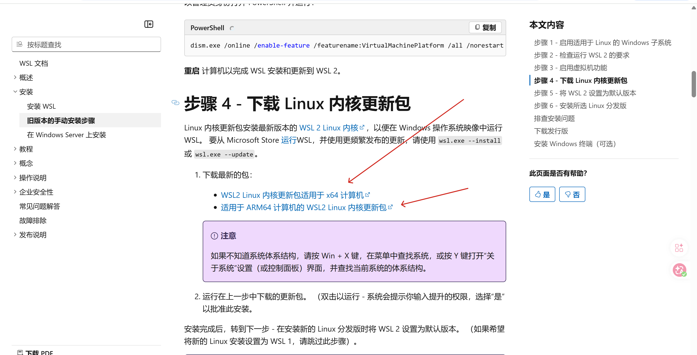

# Windows 安装 WSL (Windows Subsystem for Linux) 完整教程

WSL 是 Windows 下的 Linux 子系统，可以让你在 Windows 上直接运行 Linux 环境，无需虚拟机。本文介绍两种安装方法。

---

## 方法一：一键安装（推荐，Windows 10 2004+ 或 Windows 11）

### 1. 打开 PowerShell 或命令提示符
以**管理员身份**运行 PowerShell：
- 按 `Win + X`，选择 "Windows PowerShell (管理员)" 或 "终端(管理员)"

### 2. 运行安装命令
```powershell
wsl --install
```

这个命令会：
- 启用所需的 WSL 功能
- 下载并安装 Ubuntu 默认发行版
- 设置 WSL 2 作为默认版本

### 3. 等待安装完成
安装完成后，重启计算机。重启后，Ubuntu 会自动启动，要求你创建用户名和密码。

---

## 方法二：手动安装（旧版 Windows）

### 1. 启用 WSL 功能

在管理员 PowerShell 中运行：

```powershell
dism.exe /online /enable-feature /featurename:Microsoft-Windows-Subsystem-Linux /all /norestart
```

### 2. 启用虚拟机功能（WSL 2 需要）

```powershell
dism.exe /online /enable-feature /featurename:VirtualMachinePlatform /all /norestart
```

**重启计算机**使更改生效。

### 3. 下载并安装 WSL 2 Linux 内核更新包

- 下载地址：[WSL2 Linux 内核更新包](https://aka.ms/wsl2kernel)
- 选择适配自己设备的版本
  
- 下载后运行 `wsl_update_x64.msi` 安装

### 4. 设置 WSL 2 为默认版本

```powershell
wsl --set-default-version 2
```

### 5. 安装 Linux 发行版

打开 Microsoft Store，搜索你喜欢的发行版并安装：
- [Ubuntu 22.04 LTS](https://www.microsoft.com/store/apps/9PN20MSR04DW)
- [Ubuntu 24.04 LTS](https://www.microsoft.com/store/productId/9NZ36TKBMD1B)
- Debian, Fedora, SUSE 等也可用

安装完成后，从开始菜单打开发行版，按提示设置用户名和密码。

---

## 安装后的初始配置

### 1. 更新软件包
```bash
sudo apt update && sudo apt upgrade -y
```

### 2. 配置 Windows 和 WSL 互访
- Windows 文件系统在 WSL 中可访问：`/mnt/c/` `/mnt/d/` 等
- WSL 文件也可以从 Windows 访问：`\\wsl$\`

### 3. 设置默认用户（可选）
如果你想更改默认用户，可以在 PowerShell 中运行：
```powershell
# 对于 Ubuntu 22.04
ubuntu2204 config --default-user 用户名

# 对于 Ubuntu 24.04
ubuntu config --default-user 用户名
```

---

## 常用 WSL 命令

```powershell
# 查看已安装的发行版
wsl --list --verbose

# 停止 WSL
wsl --shutdown

# 卸载发行版
wsl --unregister 发行版名称

# 检查 WSL 版本
wsl --status
```

---

## 常见问题解决

### 1. 安装后提示 "参考的对象类型不支持尝试的操作"

以管理员运行：
```powershell
netsh winsock reset
```
重启计算机后重试。

### 2. 下载速度慢，可以手动导入发行版

去 [https://cloud-images.ubuntu.com/](https://cloud-images.ubuntu.com/) 下载 rootfs.tar.gz，然后：
```powershell
wsl --import Ubuntu-22.04 C:\WSL\Ubuntu-22.04 D:\Downloads\ubuntu-22.04-rootfs.tar.gz --version 2
```

### 3. 设置镜像源加速（国内用户）

编辑 `/etc/apt/sources.list`，替换为阿里云或清华源：
```bash
sudo cp /etc/apt/sources.list /etc/apt/sources.list.backup
sudo sed -i 's/archive.ubuntu.com/mirrors.aliyun.com/g' /etc/apt/sources.list
```

---

## 推荐配置

- 安装 [Windows Terminal](https://aka.ms/terminal) 获得更好的终端体验
- 安装 VS Code + Remote-WSL 插件，可以直接在 WSL 中开发
- 如果需要图形界面，可以考虑安装 WSLg（Windows 11 自带）或使用 X Server

安装完成后你就拥有了一个可以正常使用的 Linux 环境了！
